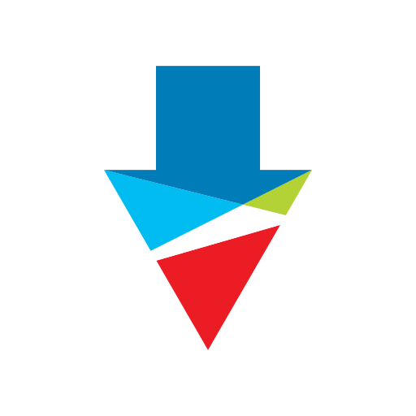

# Nicor Gas Bill Downloader

A Node.js library to bulk download utility bills from the [Nicor Gas/Southern Gas
Company customer web portal](https://customerportal.southerncompany.com/).



## Background

Most utility companies don't provide a way to bulk download utility bills and
will limit the billing history to the last two years. This limit is often
restricted by the user interface and can be bypassed by querying the server
directly. This was the case for
[Nicor Gas](https://www.nicorgas.com/) /
[Southern Company](https://www.southerncompany.com/).

## Usage

The `NicorGasBillDownloader` class contains the following methods to for
requesting and saving a bill for the Southern Gas Company customer portal:  

- `authenticate()` - Authenticates and performs the necessary server operations to download bills.
- `tryBulkDownload()` - Attempts to locate and download all bills within in range of dates.
- `tryDownloadingBill()` - Attempts to locate and download a bill for a specific month/year.
- `requestBill()` - Requests a bill for given issue date.

```javascript
import { sub } from 'date-fns';
import { NicorGasBillDownloader } from './downloader.mjs';

const ACCOUNT_NUMBER = '12349780000';
const BILL_ID = '98567123467';
const USERNAME = 'JohnDoe';
const PASSWORD = 'FooBaBaz123';

const to = new Date();
const from = sub(to, { months: 2 });
const saveDirectory = import.meta.dirname;
const billDownloader = new NicorGasBillDownloader(ACCOUNT_NUMBER, BILL_ID);
await billDownloader.authenticate(USERNAME, PASSWORD);
await billDownloader.tryBulkDownload(from, to, saveDirectory);
```

## License

MIT License
